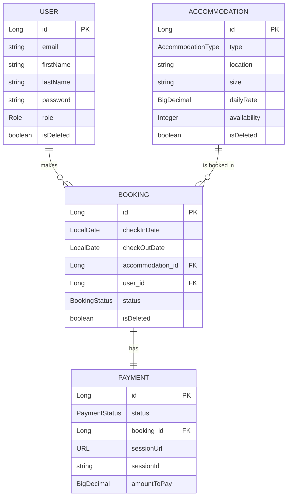

# Accommodation Booking App

A Spring Boot REST API for managing accommodation inventory, bookings, customers, and
payments, with Telegram notifications and JWT-based authentication.

## Tech stack

- Java 17, Spring Boot
- Spring Web, Spring Data JPA, Spring Security
- PostgreSQL, Liquibase
- JWT (jjwt)
- Stripe (stripe-java) for payments
- Telegram Bot API for notifications
- springdoc-openapi (Swagger UI)
- Docker / docker-compose
- JUnit 5, Mockito, AssertJ

## Clone the project

```bash
git clone https://github.com/<your-username>/accommodation.git
cd accommodation
```

## Getting started

1. Copy `.env.sample` to `.env` and fill in real values (DB credentials, a random
   `JWT_SECRET`, a Stripe **test-mode** secret key, and your Telegram bot token/chat id).
2. Run the app:

```bash
   docker-compose up --build
```

3. The API is available at `http://localhost:${SPRING_LOCAL_PORT}`.
4. Swagger UI: `http://localhost:${SPRING_LOCAL_PORT}/swagger-ui.html`
5. Health check: `GET /health`

## Running tests

```bash
./mvnw test
```

Tests run against an in-memory H2 database via the `test` Spring profile
(`application-test.properties`), so no Docker/Postgres is required to run them.
This includes controller-level integration tests under
`src/test/java/com/example/accommodation/controller/`, which exercise the full
Spring context, security filter chain, and JWT auth end-to-end via `MockMvc`.

## Roles

- `CUSTOMER` (default on registration): browse accommodations, create/manage own
  bookings, pay for own bookings.
- `MANAGER`: everything a customer can do, plus create/update/delete accommodations,
  view all users' bookings and payments, and change user roles.

## Key endpoints

| Method | Path | Description |
|---|---|---|
| POST | `/auth/register` | Register a new customer account |
| POST | `/auth/login` | Log in, receive a JWT |
| GET | `/users/me` | Current user's profile |
| PUT/PATCH | `/users/me` | Update current user's profile |
| PUT | `/users/{id}/role` | Change a user's role (manager only) |
| GET | `/accommodations` | List accommodations (public) |
| POST/PUT/PATCH/DELETE | `/accommodations/**` | Manage accommodations (manager only) |
| POST | `/bookings` | Create a booking |
| GET | `/bookings/my` | Current user's bookings |
| GET | `/bookings?userId=&status=` | Filtered booking search (manager only) |
| POST | `/payments` | Create a Stripe checkout session for a booking |
| GET | `/payments/success` / `/payments/cancel` | Stripe redirect handlers |

## Data model

